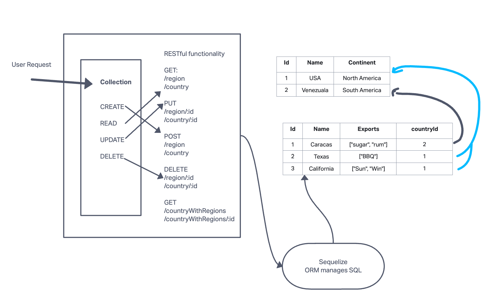

# RESTful API Server

## Project: RESTful API Server

### Author: Francisco

### Problem Domain

RESTful API Server that can log regions and countries while add database abstraction and associations to your API.

### Links and Resources

- [GitHub Actions ci/cd](https://github.com/c0d3cisco/api-server/actions)
- [Back-end prod server url](https://api-server-lab04.onrender.com/)

## Collaborators

Code was written while Ryan Gallaway taught a class for API Server.

### Setup

#### `.env` requirements (where applicable)

port variable exists within the env sample

Ensure to have sequelize database URL in the env file

#### How to initialize/run your application (where applicable)

1. Clone this repository to a location of your choosing. In the terminal, navigate to the directory and run the following commands:
2. `npm i` to install dependencies
3. **Copy** the `.env.sample` file and rename it to `.env`, then **update** the `.env` file with your `PORT` and `DATABASE_URL`
4. Run `db:config` to create the `config.json` file
5. **Update** the "username" in `config.json` with your PostgreSQL username and set the "dialect" to "postgres"
6. Run `db:create` to create the database
7. Run `nodemon` to start the server
8. Use Thunder Client to utilize API functionality with the routes listed below

#### Routes

##### Regions

- `GET /regions` - get all regions
- `GET /regions/:id` - get one region
- `POST /regions` - create a region
- `PUT /regions/:id` - update a region
- `DELETE /regions/:id` - delete a region

##### Countries

- `GET /countries` - get all countries
- `GET /countries/:id` - get one country
- `POST /countries` - create a country
- `PUT /countries/:id` - update a country
- `DELETE /countries/:id` - delete a country

##### Countries with Regions

- `GET /countryWithRegions` - get all regions for a country
- `GET /countryWithRegions/:id` - get one region for a country

#### Tests

run the command `npm test`

#### UML

